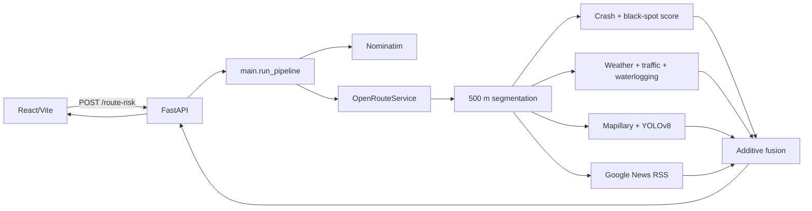

# SafeRoute Telangana

SafeRoute Telangana is an explainable road-safety analysis prototype for journeys in and around Hyderabad/Telangana. It obtains a driving route, divides it into approximately 500 m segments, enriches each segment with historical crash proximity, current weather, traffic, known waterlogging locations, road-surface vision, and local news, then returns a 0–100 composite risk score with a plain-language explanation.

Built for the AI Careers for Women (AICW) Capstone Program, supported by Microsoft.

## Why SafeRoute

Traditional navigation minimizes travel time or distance. SafeRoute is a decision-support layer: it exposes safety-relevant evidence and the uncertainty around that evidence so a driver can compare route trade-offs. It is not a collision prediction service or emergency guidance.

## What It Currently Does

With working provider credentials and runtime assets, the backend:

1. Geocodes origin/destination names with Nominatim.
2. Requests an OpenRouteService driving route.
3. Splits the polyline into fixed-length segments.
4. Reverse-geocodes each midpoint to a road/locality name.
5. Scores historical crash and black-spot proximity, then applies a day-of-week modifier.
6. Requests Open-Meteo weather and TomTom traffic per segment.
7. Flags waterlogging only when adverse weather and a static waterlogging point coincide.
8. Queries Mapillary at start/middle/end segment points and runs YOLOv8. If local RDD2022 test images are available, it falls back to one when Mapillary has no coverage.
9. Queries Google News RSS for road-name-relevant hazard headlines.
10. Adds those signals into a capped segment score, averages segments for a route score, and evaluates OpenRouteService alternatives.

The React application calls FastAPI through `VITE_API_BASE_URL` (default `http://127.0.0.1:8000`) and renders route results, maps, segment diagnostics, a reroute advisory, a loaded-route heatmap, and supporting pages.

### Current boundaries

- The repository does **not** include `backend/data/india_subset/test/images`; the RDD2022 fallback path is unavailable in a fresh checkout unless those assets are restored.
- Waterlogging and black-spot data are static CSV reference data, not live municipal feeds.
- News urgency/recency helpers exist but are not used by final risk fusion.
- Saved routes and route state are not persisted.

## System Architecture



## End-to-End Pipeline

### Routing and segmentation

- `backend/src/api_clients/geocode.py`: Nominatim search/reverse-geocode with Hyderabad-biased queries and a one-second delay after successful calls.
- `backend/src/api_clients/maps_routing.py`: OpenRouteService GeoJSON driving routes; converts GeoJSON `[lon, lat]` to internal `(lat, lon)`.
- `backend/src/data_pipeline/segmentation.py`: creates UUID-prefix IDs and groups polyline points into roughly 500 m segments.

### Historical risk

`backend/clean_data.py` derives:

```text
severity = killed × 5 + injured × 1
```

`historical_score.py` checks black spots within 400 m and crashes within 300 m:

```text
historical_score = 0.6 × max_blackspot_proximity_score
                 + 0.4 × nearby_crash_severity_score
```

`time_pattern.py` multiplies this historical score by the current day-of-week profile. The source lacks hour-level data.

### Live and reference signals

- **Weather:** `weather.py` requests Open-Meteo precipitation, wind and visibility; only precipitation/wind thresholds contribute. Request failure returns 0.
- **Traffic:** `traffic.py` requests TomTom flow data and maps current/free-flow ratio to low/medium/high/severe. It has no error fallback.
- **Waterlogging:** `waterlogging.py` reads static CSV coordinates and matches within 300 m.
- **News:** `news_check.py` queries Google News RSS, applies road-name plus hazard-keyword filtering, and caches process-local results. `get_news_flags_weighted` is not called by fusion.

### Risk engine

`backend/src/risk_engine/fusion.py` currently calculates:

```text
final_score = min(100,
  historical_score + weather_modifier + traffic_points
  + (15 if waterlogging_flag else 0)
  + vision_points + (8 if news_flags else 0)
)
```

Traffic points are low 0, medium 5, high 12, severe 20. Vision points are none 0, minor 5, moderate 12, severe 22. Route total risk is the arithmetic mean of segment scores.

## AI / ML

### Road-damage model

- **Architecture:** YOLOv8s; bundled weights `backend/src/vision/best.pt` (~22.5 MB).
- **Training data:** RDD2022 India subset.
- **Classes:** longitudinal crack, transverse crack, alligator crack, other corruption, pothole.
- **Training script:** `backend/src/vision/train.py`; 50 epochs, 640 px, batch 16, `yolov8s.pt`. The code does not explicitly pass an optimizer; project documentation records an Ultralytics auto/AdamW run.
- **Documented split:** train 5,368; validation 1,172; test 1,166.
- **Retained v2 result:** overall mAP50 0.404, precision 0.530, recall 0.374.
- **v3 experiment:** `augment_data.py` brightness-augmented transverse-crack images. Documentation reports transverse mAP50 improved 0.187 → 0.227 while overall mAP50 regressed 0.404 → 0.391; v2 was retained.

`detect.py` generates an ordinal `none/minor/moderate/severe` severity from confidence, class weighting, bounding-box area (assuming 640 × 640) and detection count. It downloads URL images before inference to avoid the documented Mapillary URL/video-stream issue.

### Mapillary behavior

`vision_pipeline.py` queries Mapillary at a fixed 50 m radius for a segment’s start/middle/end. If no image exists, it tries a random local RDD2022 test image. That dataset folder is currently absent, so a fresh runtime produces `none/no_image_available` rather than a fallback image.

### AI limitations

RDD2022 India is India-wide rather than Hyderabad-specific. Mapillary coverage can be sparse at 50 m. Transverse-crack validation support is documented as scarce. Vision severity is an additive ordinal signal, not a calibrated probability of road failure.

## Frontend

React 19 + TypeScript + Vite, React Router, Leaflet and React-Leaflet.

| Route | Purpose | Data behavior |
|---|---|---|
| `/` | Executive overview | Editorial/static |
| `/route-planner` | Origin/destination, autocomplete, geolocation, city news | FastAPI |
| `/route` | Route summary, Leaflet map, segment list | In-memory route context |
| `/segment/:segmentId` | Segment AI diagnostics | In-memory route context |
| `/hazard-advisory` | Worst/lowest loaded-segment advisory | In-memory route context |
| `/analytics` | Loaded-route heatmap and derived charts | In-memory route context |
| `/saved-corridors` | Commute archive/watchlist | UI state and presets only |
| `/methodology` | Architecture and model disclosure | Editorial/static |
| `/capstone-showcase` | Team and source showcase | Editorial/static |
| `/about` | How SafeRoute Works | Editorial/static |

```text
Route Finder → POST /route-risk → Route Results → Segment Diagnostics
                                         ├→ Analytics Heatmap
                                         └→ Hazard Advisory
Route Finder → Saved Corridors
Global navigation/footer → About, Methodology, Capstone Showcase
```

The active route is held only in `frontend/src/context/RouteContext.tsx`. Refreshes and direct deep-links cannot restore it. Header links to fixed segment IDs also require a current matching route.

## Backend API

Entry point: `backend/api/main.py`.

| Method | Endpoint | Request | Response |
|---|---|---|---|
| POST | `/route-risk` | `{ origin, destination }` | `{ route_total_risk, segments }` |
| POST | `/alternate-route` | `{ origin, destination }` | availability, risks, time delta, optional segment lists |
| GET | `/location-suggestions?q=` | query | Nominatim-derived suggestions |
| GET | `/reverse-geocode?lat=&lon=` | query | `{ label }` |
| GET | `/city-news` | none | `{ headlines }` |

There are no explicit response models or provider-error translation. CORS allows only `http://localhost:5173`; configure `VITE_API_BASE_URL` accordingly.

## Data Inventory

| File/source | Current contents/use | Status |
|---|---|---|
| `backend/data/processed/telangana_crashes.csv` | 114 rows with coordinates, weekday, killed/injured and derived severity | Runtime input |
| `backend/data/raw/news_crashes.xlsx` | source workbook | Present; not runtime input |
| `backend/data/external/black_spots.csv` | 38 location rows | Runtime input; provenance/validation should be reviewed |
| `backend/data/external/waterlogging_points.csv` | 121 coordinate rows | Runtime input; static reference data |
| `backend/src/vision/best.pt` | model weights | Runtime asset |
| `backend/data/india_subset/` | training/fallback imagery expected by code | **Absent** |
| `frontend/src/assets.config.ts` | Unsplash/pravatar assets | Display-only placeholders |

## Project Structure

```text
SafeRoute/
├── backend/
│   ├── api/main.py                  # FastAPI endpoints
│   ├── main.py                      # pipeline orchestration / CLI
│   ├── src/
│   │   ├── api_clients/             # Nominatim and OpenRouteService
│   │   ├── data_pipeline/           # segmentation
│   │   ├── live_signals/            # weather, traffic, waterlogging
│   │   ├── news/                    # Google News RSS
│   │   ├── risk_engine/             # historical score, fusion, explanations
│   │   ├── routing/                 # alternate routes
│   │   └── vision/                  # model, inference, training, augmentation
│   ├── data/                        # raw, processed and static external files
│   ├── docs/                        # notes/API contract
│   └── tests/test_pipeline.py
├── frontend/
│   ├── src/pages/                   # application routes
│   ├── src/components/              # maps, drawer, layout
│   ├── src/context/RouteContext.tsx # in-memory route state
│   └── src/services/api.ts          # fetch client
├── requirements.txt
└── .env.example
```

## Setup (Windows)

### Backend

```powershell
python -m venv .venv
.\.venv\Scripts\Activate.ps1
pip install -r requirements.txt
Copy-Item .\.env.example .\backend\.env
Set-Location backend
..\.venv\Scripts\python.exe -m uvicorn api.main:app --reload
```

Place provider variables in `backend/.env` because backend code uses `load_dotenv()` from its current working directory:

```text
ORS_API_KEY
TOMTOM_API_KEY
MAPILLARY_TOKEN
```

`OPENWEATHERMAP_API_KEY` remains in `.env.example`, but current weather code uses Open-Meteo and does not read it.

### Frontend

```powershell
Set-Location frontend
npm install
$env:VITE_API_BASE_URL = "http://127.0.0.1:8000"
npm run dev
```

Vite normally serves `http://localhost:5173`, the only origin currently allowed by FastAPI CORS.

## Testing

### Backend

```powershell
Set-Location backend
$env:PYTHONPATH = "."
..\.venv\Scripts\python.exe -m pytest tests -q
```

Tests combine offline checks with provider/model-dependent route and alternate-route checks. They need credentials, network access, and usable vision assets.

### Frontend

```powershell
Set-Location frontend
npm run lint
npm run build
```

At this README update, lint completes with warnings. Build is blocked by two unused imports (`Clock`, `CloudRain`) in `src/pages/RoutePlanner.tsx`; remove/use them before release.

## Known Limitations

- Provider errors are handled inconsistently: weather returns zero on network failure, whereas traffic/geocoding/routing/reverse-geocoding/news/model failures can surface as server errors.
- Segment IDs are newly generated per request; there is no persistence, saved-route API, or shareable diagnostic deep-link.
- Saved Corridors uses presets/local component state; it is not a persistence service.
- Hazard Advisory compares worst/lowest segments from the same loaded route; it does not render an independently generated alternate route.
- The analytics diurnal chart is derived from loaded scores/time bands, not a historical hourly forecast.
- `backend/docs/api_contract.md` is stale: it says `image_url` needs adding, but multi-point vision already returns it.

## Security Notes

- `.env` is ignored by Git; never commit provider tokens.
- The API has no authentication or rate limiting and allows all methods/headers for its one development origin.
- Provider tokens are backend-only; the frontend does not bundle them.
- Map tiles, Mapillary imagery, Google fonts and some editorial assets load from external services.
- Request strings are minimally schema-validated; outbound providers receive user text/coordinates.

## Team

The repository identifies the AICW team as Umaima, Alizah, Zunairah and Shazia.

### Vision & News Modules — Zunairah

- YOLOv8 road-damage detection and weighted severity scoring
- RDD2022 India training documentation and targeted transverse-crack augmentation experiment
- precision/recall and v2/v3 comparison documentation
- Mapillary multi-point lookup and RDD fallback design
- URL/image handling fix for YOLO inference
- Google News RSS relevance filtering, urgency classification and recency-weighting helpers
- vision/news pipeline testing documentation and frontend contribution

Other role statements should be reviewed by the team before external publication.
