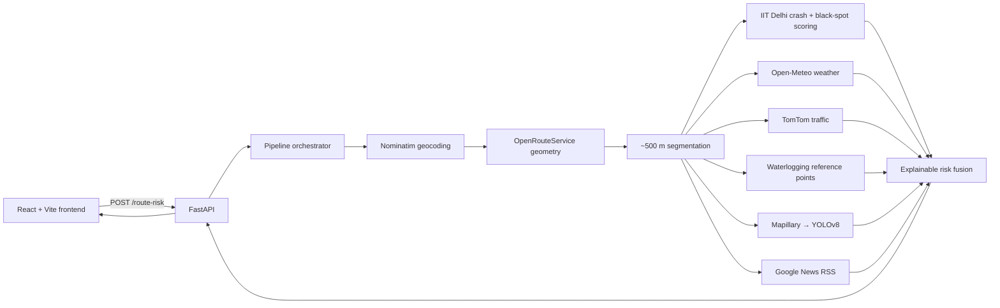

# SafeRoute Telangana

SafeRoute Telangana is an explainable civic road-safety intelligence application for journeys in Hyderabad and across Telangana. It is built around a simple premise: conventional navigation optimises for time and distance, while a safety-aware route decision should make crash history, weather, congestion, inundation, road condition, and incident context visible before a driver commits to a corridor.

The project was developed for the **AI Careers for Women (AICW) Capstone Program**, supported by Microsoft.

> SafeRoute is a decision-support prototype. It is not emergency guidance, a collision-prediction service, or a replacement for official traffic instructions.

## Product capabilities

- Search a Hyderabad/Telangana journey using origin/destination autocomplete and analyze the route.
- Split route geometry into approximately 500 m segments and calculate a transparent 0–100 safety score for each segment.
- Inspect the full route on an interactive Leaflet map, including road-level scores, weather, traffic, vision, incident, and advisory context.
- Open a segment AI diagnostics page that explains the score’s historical crash, weather/inundation, traffic, road-surface vision, and news/dispatch inputs.
- Compare a backend-scored alternate route when it is meaningfully safer within the configured time trade-off.
- Run a real-time hazard/reroute advisory and route-drive simulation from the currently loaded route data.
- Download a one-page safety report for the active route and a structured safety report for saved corridors.
- Use the Live Analytics & Risk Heatmap workspace to inspect spatial risk, active detections, signal inventory, exact risk distribution, and the route’s current exposure field.
- Maintain session-level route/hazard/reroute counters persisted locally in the browser.

## User journey

```text
Overview
  └── Safe Route Finder
        └── Route Results
              ├── Segment AI Diagnostics & Risk Breakdown
              ├── Live Analytics & Risk Heatmap
              ├── Real-Time Hazard & Reroute Advisory
              ├── Download Safety Report
              └── Saved Corridors & Historical Commute Archive

Global navigation / footer
  ├── How SafeRoute Works
  ├── System Architecture & Methodology
  └── Capstone Team & Microsoft Evaluator Showcase
```

The active route is held in React route context for the current browser session. Segment diagnostics, analytics, advisory, and saved-corridor screens therefore use the same loaded data rather than independently fabricated examples.

## Architecture



## Risk model

Each route segment is evaluated independently. The backend fuses these currently available components:

| Signal | Source | Contribution / behavior |
|---|---|---|
| Historical crash context | IIT Delhi Telangana-filtered crash data + black-spot CSV | Base historical score using proximity and severity. |
| Day pattern | Crash-data weekday profile | Modifies historical exposure by current day-of-week evidence. |
| Weather | Open-Meteo current precipitation, wind, visibility | Adds 0, 10, or 20 points based on adverse conditions. A clear live reading correctly contributes 0. |
| Traffic | TomTom flow segment current/free-flow speed ratio | Maps to low 0, medium 5, high 12, severe 20 points. |
| Inundation | Static municipal/GHMC-style waterlogging reference coordinates + live weather | Flags only when a segment is near a reference point and weather is adverse. |
| Surface condition | Mapillary imagery where covered, analyzed by YOLOv8; RDD2022 fallback when available | Adds none 0, minor 5, moderate 12, severe 22 points. |
| News | Google News RSS road-name-relevant hazard headlines | Uses urgency/recency-derived score, capped in risk fusion. |

The segment score is capped at 100; the route score is the arithmetic mean of scored segments. Explanations are generated from the actual contributions recorded on each segment.

### Provider integrity

SafeRoute does not silently turn failed external calls into safe-looking readings:

- Open-Meteo clear weather appears as **live clear / no score lift**, not “missing weather.”
- TomTom failures or absent credentials appear as **traffic unavailable** and contribute no made-up traffic risk.
- Mapillary no-coverage falls back to bundled RDD2022 imagery only when that local asset is present; otherwise vision is marked unavailable.
- Google News returning no road-relevant hazard headline is a valid “no relevant reports” result.
- Waterlogging data is a static reference dataset, not a real-time municipal sensor feed.

## Frontend

The frontend is a React 19 + TypeScript + Vite application. It uses Tailwind design tokens, React Router, Leaflet/React-Leaflet, Framer Motion, and jsPDF.

| Route | Screen | Data behavior |
|---|---|---|
| `/` | Overview | Product narrative, entry points, session stats. |
| `/route-planner` | Safe Route Finder | Search, location suggestions, city news, and route submission. |
| `/route` | Route Results | Current route context, interactive map, simulation, alternate route, route PDF. |
| `/segment/:segmentId` | Segment Diagnostics | Current route context; detailed factor breakdown. |
| `/hazard-advisory` | Hazard & Reroute Advisory | Current route and alternate-route context. |
| `/analytics` | Live Analytics & Risk Heatmap | Current route context and derived visualizations. |
| `/saved-corridors` | Saved Corridors Archive | Current route context plus local watchlist UI state. |
| `/about` | How SafeRoute Works | Supporting product information. |
| `/methodology` | Architecture & Methodology | Supporting technical/evaluator information. |
| `/capstone-showcase` | Team & Evaluator Showcase | Supporting capstone information. |

### Analytics workspace

Analytics is intentionally based on the loaded route, not a citywide dashboard pretending to have backend aggregation that does not exist.

- **Corridor Heatmap:** segment midpoint risk plotted on the actual current route geometry.
- **Risk Distribution:** Low (0–29), Moderate (30–49), High (50–74), and Severe (75–100) counts and percentages derived directly from all loaded segments. Bucket selection reveals the represented segment links.
- **Current Exposure Field:** an interactive layered signal weave. Historical, weather, traffic, surface, and incident ribbons vary in thickness according to actual per-segment contribution; selecting a segment exposes its road, risk score, dominant factor, and advisory state.
- **Detection Feed:** active weather, traffic, vision, inundation, and news events only.
- **Signal Inventory:** the complete segment telemetry ledger, including clear and unavailable statuses.

## Backend API

FastAPI entry point: `backend/api/main.py`.

| Method | Endpoint | Request | Response |
|---|---|---|---|
| `POST` | `/route-risk` | `{ "origin", "destination" }` | Route total, scored segments, reroute prompt status. |
| `POST` | `/alternate-route` | `{ "origin", "destination" }` | Availability, primary/alternate risks, time delta, optional segment lists. |
| `GET` | `/location-suggestions?q=` | Search query | Nominatim-derived suggestions. |
| `GET` | `/reverse-geocode?lat=&lon=` | Coordinates | Display label. |
| `GET` | `/city-news` | None | Hyderabad RSS headlines. |
| `GET` | `/vision-fallback/:file` | Image filename | Local RDD2022 fallback image when available. |

The frontend API base defaults to `http://127.0.0.1:8000` and can be overridden through `VITE_API_BASE_URL`.

## Repository layout

```text
SafeRoute/
├── backend/
│   ├── api/main.py                 # FastAPI endpoints and CORS/static fallback mount
│   ├── main.py                     # route scoring orchestration
│   ├── clean_data.py               # crash-data preparation utility
│   ├── inspect_data.py             # dataset inspection utility
│   ├── src/
│   │   ├── api_clients/            # Nominatim + OpenRouteService
│   │   ├── data_pipeline/          # route segmentation
│   │   ├── live_signals/           # weather, traffic, inundation
│   │   ├── news/                   # Google News RSS relevance and risk
│   │   ├── risk_engine/            # historical scoring, fusion, explanations
│   │   ├── routing/                # safer alternate selection
│   │   └── vision/                 # YOLOv8 inference, training, augmentation, Mapillary
│   ├── data/
│   │   ├── external/               # black spots + waterlogging reference points
│   │   ├── processed/              # Telangana crash dataset
│   │   ├── raw/                    # source workbook/data dictionary
│   │   └── india_subset/           # local RDD2022 fallback images
│   ├── docs/                       # API contract and methodology notes
│   └── tests/                      # pipeline tests
├── frontend/
│   ├── src/components/             # maps, navigation, drawer, images, badges
│   ├── src/context/RouteContext.tsx# active-route/session state
│   ├── src/pages/                  # product and supporting routes
│   ├── src/services/api.ts          # FastAPI client
│   └── src/types/route.ts           # shared route segment contract
├── requirements.txt
├── .env.example
└── README.md
```

## Data and model assets

- `backend/data/processed/telangana_crashes.csv`: Telangana-filtered crash rows used for proximity and day-pattern scoring.
- `backend/data/external/black_spots.csv`: black-spot reference locations.
- `backend/data/external/waterlogging_points.csv`: 121 waterlogging reference coordinates.
- `backend/data/raw/news_crashes.xlsx` and `Data Dictionary.xlsx`: raw/source project data artifacts.
- `backend/src/vision/best.pt`: local YOLOv8 weights.
- `backend/data/india_subset/test/images/`: RDD2022 India fallback imagery served to the browser when Mapillary coverage is absent.

## Local setup

### Prerequisites

- Python 3.10+ with a virtual environment
- Node.js 20+ and npm
- Provider credentials for OpenRouteService, TomTom, and Mapillary
- Network access for external providers and map tiles

### Environment

Create a **root** `.env` file from `.env.example`. The backend explicitly loads this root file, so it works whether Uvicorn is started from the project root or `backend/`.

```text
ORS_API_KEY=your_openrouteservice_key
TOMTOM_API_KEY=your_tomtom_key
MAPILLARY_TOKEN=your_mapillary_access_token
```

Never commit `.env` or provider credentials.

### Start the backend

```powershell
python -m venv .venv
.\.venv\Scripts\Activate.ps1
pip install -r requirements.txt

Set-Location backend
..\.venv\Scripts\python.exe -m uvicorn api.main:app --reload --host 127.0.0.1 --port 8000
```

### Start the frontend

In a second terminal:

```powershell
Set-Location frontend
npm install
$env:VITE_API_BASE_URL = "http://127.0.0.1:8000"
npm run dev
```

Open the Vite URL shown in the terminal, normally `http://localhost:5173` or `http://127.0.0.1:5173`.

## Verification

### Frontend build

```powershell
Set-Location frontend
npm run build
```

### Backend tests

```powershell
Set-Location backend
$env:PYTHONPATH = "."
..\.venv\Scripts\python.exe -m pytest tests -q
```

### Manual route check

1. Run backend and frontend with valid root `.env` credentials.
2. Open **Safe Route Finder** and analyze a Hyderabad route, for example `Ameerpet, Hyderabad` to `Secunderabad, Hyderabad`.
3. Confirm Route Results shows segment data; open map markers to inspect live/clear/unavailable signal states.
4. Open a segment diagnostics page to verify source-labelled factor breakdown.
5. Open Analytics; select an Exposure Field segment and a Risk Distribution bucket, then verify the shown roads match the loaded route.
6. Download the route or saved-corridor safety report and compare contents with on-screen segment data.

## Known limitations

- Route/segment state is intentionally in-memory and is not restored after a full page refresh.
- Saved Corridors is a frontend watchlist tied to the loaded route; a server-side persistence API is future work.
- Waterlogging points and black spots are reference datasets and must be refreshed from authoritative sources for production use.
- Mapillary imagery can be unavailable for a specific street even with a valid token; local RDD2022 imagery is a fallback sample, not a location-matched image.
- News relevance depends on RSS indexing and road-name matching. No relevant headline is not evidence that an incident does not exist.
- The hazard advisory simulates movement over returned route geometry. It does not connect to a live vehicle GPS feed.
- Provider availability, quotas, and data quality remain external dependencies.

## Team

Built by **Zunairah, Umaima, Alizah, and Shazia** for the AICW Capstone Program.
